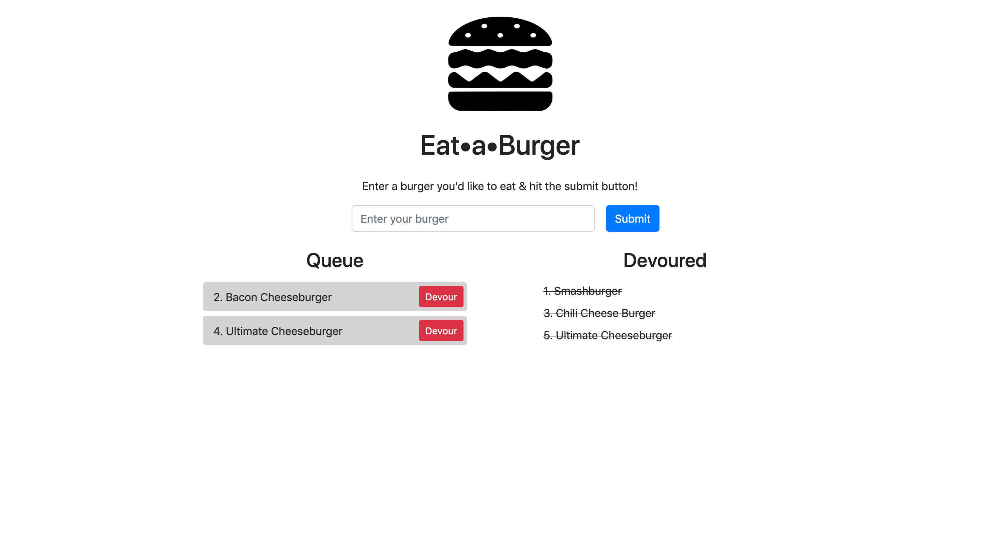

# Eat&bull;a&bull;Burger

This is a restaurant app - users can input the names of burgers they'd like to eat.

There is a queue of burgers to be eaten, and a list of burgers that have already been devoured.

Once a burger is added to the queue, you can click the "Devour" button, and it will be moved to the Devoured list.

This app was built with Node.js, Express, MySQL, and Handlebars.

[See it deployed ->](https://sleepy-temple-70496.herokuapp.com/)

